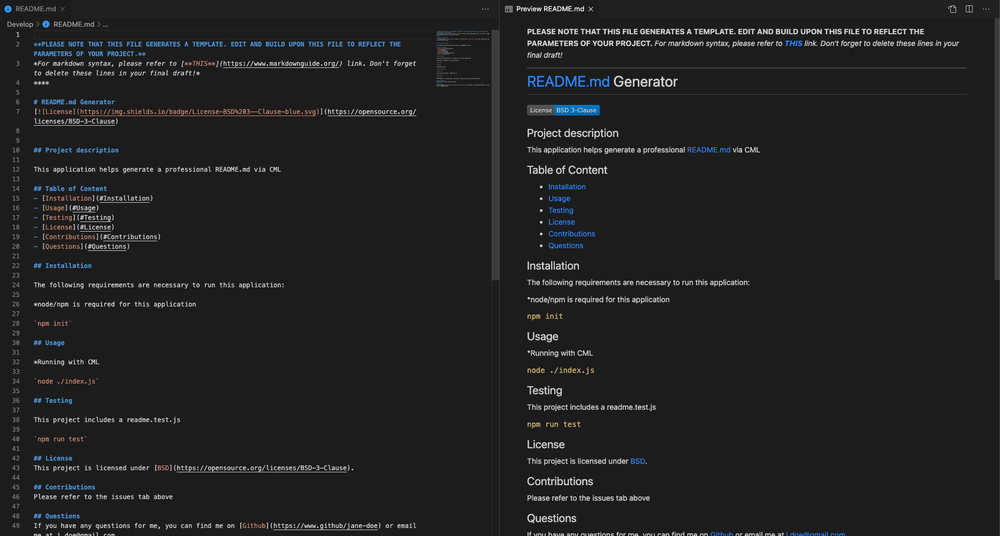

# CML_README_GEN

## Project overview

This application is a back-end README generator, requesting user inputs via command line and generating a professional style README file **template** to be edited and build upon for any project.


### Project Status:

*Completed*

****

## Project Details

### Project-build Aspects:

The following components are used to build the code for this project:

1. **JavaScript**
    - Node.js > npm
        * file-system *default module of npm*
        * Inquirer
    - functions with switch/case conditional statments to generate license badges

### Functionality:

With all packages installed, the user will be able to use command line inputs to generate a README file template with all the conventional sections filled out. There is a link for novice markdown users included at the top of the generated template as a resource. 

****

## Installation

1. Clone this repository onto local workspace
2. Open Terminal (MacOS) or Git Bash (Windows) and change location to where you want the cloned directory
3. Type `git clone` and paste copied respository
4. Directory should include the following:
    * Develope directory
        - utils directory
            * `generateMarkdown.js`
    * `index.js`
    * `.gitignore`
    * `package.json`
    * `package-lock.json`
    * assets directory
        - images directory : *for README file only*
    * `README.md`
5. A code editor (i.e. the editor you will see referred to here is [Visual Studio Code](https://code.visualstudio.com/))
5. Node and npm is necessary to run this application - please click [HERE](https://docs.npmjs.com/downloading-and-installing-node-js-and-npm) for documentation on how to install this package for your OS.

## Usage

### Running with CLI:

```
$ directory node ./index.js
```

(where **directory** is the location of your index.js file)

## Project Walkthrough Video

*WIP*

## Project Screenshots

This screenshot below shows that the user can implement this application via their code editor or terminal(MacOS)/CMD(Windows):


Using the code editor, you can pull up the source code as well as access the README.md file that is generated -<span style = "color:violet"> as seen in the purple box to the left.</span>

On the other hand, using terminal/CMD will require the user to open their code editor to pull up the generated README.md file - <span style = "color:orange">as seen underlined and arrow-ed in orange.</span>

****

This screenshot below is the sample README.md file generated from the prompts seen in the previous screenshot:



This file can then be saved, moved, copy/pasted to where the user requires it. You can also see the first few lines in the README.md indicating that the user should edit the file to their needs and further resources if they require them.


****

## Deployment

This application has no URL deployment functionality. Please refer to the [Installation](#Installation) section to test/use.

****

## Credit

* Inquirer.js[Documentation](https://www.npmjs.com/package/inquirer)
* Full-stack Bootcamp Program @ [Washington University, Saint Louis](https://bootcamp.tlcenter.wustl.edu/) through [© 2021 Trilogy Education Services, LLC, a 2U, Inc. brand](https://www.trilogyed.com/)
* Walkthrough video created using [© Screencastify,LLC 2020](https://www.screencastify.com/)


